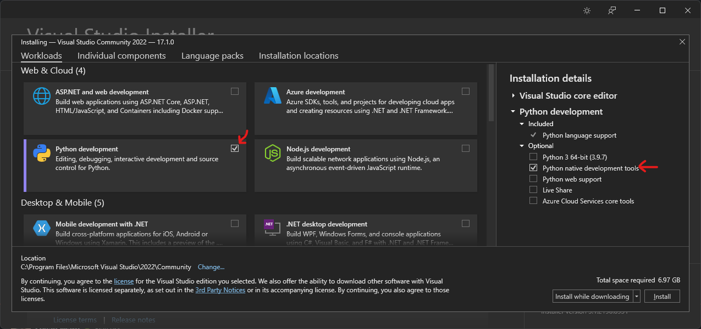

# Detailed Installation Instructions

Linux is the preferred OS for these lecture materials, but it is possible to run (most) things on Windows or OS X. 
Special instructions for each operating system are below.

We skip installing [`qml`](https://github.com/qmlcode/qml/) for both Windows and OS X. QML is needed in only [one notebook](../molecular-property-prediction/kernel-methods/fchl-in-one-notebook.ipynb) and is difficult to install on operating systems other than Linux.

## Basic Instructions

In all cases, we recommend installing [Mamba](https://github.com/mamba-org/mamba) to build the environment quickly.

First, install Miniconda following [Anaconda's instructions](https://docs.conda.io/en/latest/miniconda.html).

> The next parts require using the command line. See [DjangoGirl's excellent tutorial](https://tutorial.djangogirls.org/en/intro_to_command_line/), if needed

Download the repository as a ZIP file or [clone it using git](https://docs.github.com/en/github/creating-cloning-and-archiving-repositories/cloning-a-repository) then navigate to the folder. 

[Install Mamba](https://github.com/mamba-org/mamba#installation) using the command line:

```
conda install -c conda-forge mamba
```

Mamba implements all of the features but is much faster. Speed is particularly advantageous given the large and complex environments used in this class.


## Operating-System Specific

### Linux

The [`environment.yml`](../environment.yml) file in the root directory is designed for Linux. 

To install _all_ of the packages, you will need to install C++ and FORTRAN compilers along with development versions of the LAPACK and BLAS libraries.
Many compute clusters (e.g., RCC at UChicago) should have these installed already.
If you are using Ubuntu, you can install them with:

```
sudo apt install build-essentials gfortran libblas-dev liblapack-dev
```

If you cannot install the libraries, remove the `qml` and `dscribe` libraries from your build environment by adding a "#" to the beginning of the line containing those packages in `environment.yml`.

### Windows (10 or greater)

The [`envs/environment-windows.yml`](./environment-windows.yml) contains an environment with versions of packages that will install properly on Windows. 

You will need to install a C++ compiler on Windows to use _all_ of the packages and the [preferred route is to use Visual Studio](https://wiki.python.org/moin/WindowsCompilers#Microsoft_Visual_C.2B-.2B-_14.x_with_Visual_Studio_2022_.28x86.2C_x64.2C_ARM.2C_ARM64.29). Make sure to select the "Native Development" option along with the Python development tools.




The only package that requires C++ support is [`dscribe`](https://singroup.github.io/dscribe), which is used in the "kernel methods" notebooks and related homework assignment. So, if you do not plan to use the kernel methods module then you can exclude `dscribe` from the installation by adding a `#` to the front of the line containing `- dscribe` in `environment-windows.yml`.
If you do so, you will not need Visual Studio.

Once you either install Visual Studio or remove the DScribe package, then you can install the environment with:

```
mamba install --file envs/environment-windows.yml --force
```

### OS X

*Under construction*

OS X, like Windows and Linux, requires you to install C++ compilers to use all packages in the environment.

Install C++ using the command line tools of XCode. Follow the instructions here: [XCode FAQs](https://developer.apple.com/library/archive/technotes/tn2339/_index.html#//apple_ref/doc/uid/DTS40014588-CH1-DOWNLOADING_COMMAND_LINE_TOOLS_IS_NOT_AVAILABLE_IN_XCODE_FOR_MACOS_10_9__HOW_CAN_I_INSTALL_THEM_ON_MY_MACHINE_)

The only package that requires C++ support is [`dscribe`](https://singroup.github.io/dscribe), which is used in the "kernel methods" notebooks and related homework assignment. So, if you do not plan to use the kernel methods module then you can exclude `dscribe` from the installation by adding a `#` to the front of the line containing `- dscribe` in `environment-osx.yml`.
If you do so, you will not need XCode.

Once you either install XCode or remove the DScribe package, then you can install the environment with:

```
mamba install --file envs/environment-osx.yml --force
```


